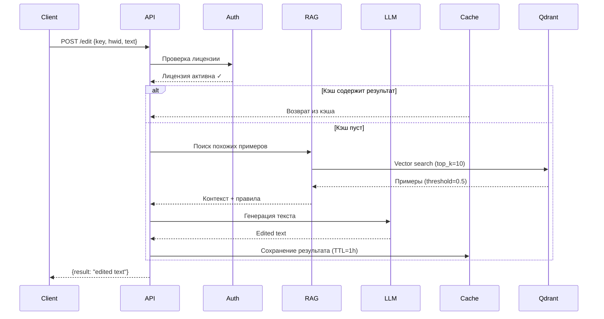

<!-- filepath: README.md -->

# AdManager — AI-Powered Ad Text Editing Service

<div align="center">


**AI-сервис для автоматического редактирования рекламных объявлений**

[](https://www.python.org/downloads/)
[](https://fastapi.tiangolo.com/)
[](LICENSE)
[](https://github.com/GloryWater/backend-for-using-ai/actions/workflows/ci.yml)
[](https://github.com/astral-sh/ruff)
[](docker-compose.yaml)

</div>

---

## 📋 Table of Contents

- [Features](#-features)
- [Architecture](#-architecture)
- [Quickstart](#-quickstart)
- [Environment Variables](#-environment-variables)
- [API Endpoints](#-api-endpoints)
- [Development](#-development)
- [Testing](#-testing)
- [License](#-license)

---

## ✨ Features

### Core Functionality

- **🤖 AI Text Editing** — Автоматическое редактирование рекламных текстов с использованием LLM (GPT-4o-mini) и RAG-системы
- **📚 Vector Search** — Поиск похожих объявлений в базе знаний (Qdrant, 6494+ примеров)
- **🔐 License Management** — Система лицензирования с HWID-привязкой и пробным периодом (7 дней)
- **💳 Multiple Payment Methods** — Telegram Stars, CryptoCloud (криптовалюта), Tribute (банковские карты)
- **🤖 Telegram Bot** — Удобное взаимодействие с пользователями через @bot
- **⚡ Rate Limiting** — Защита от злоупотреблений с настраиваемыми лимитами

### Technical Features

- **🚀 High Performance** — Async FastAPI backend с uvicorn
- **🗄️ PostgreSQL + AsyncPG** — Асинхронная работа с базой данных
- **🎯 Qdrant Vector DB** — Быстрый семантический поиск (paraphrase-multilingual-MiniLM-L12-v2)
- **🔄 Auto-Updates** — Watchtower для автоматического обновления контейнеров
- **🧪 Comprehensive Testing** — Unit, integration, load, stress, soak, spike, chaos тесты
- **📊 Health Checks** — Kubernetes-ready endpoints для мониторинга

---

## 🏗 Architecture

### System Components

```
┌─────────────────┐
│  Telegram Bot   │ (aiogram 3.x)
│  (контейнер)    │
└────────┬────────┘
         │
         ↓
┌─────────────────────────────────────────┐
│          FastAPI Backend                │
│  ┌───────────────────────────────────┐  │
│  │  AIService (LLM + RAG)            │  │
│  │  • OpenAI-совместимый API         │  │
│  │  • Sentence Transformers          │  │
│  │  • Qdrant (векторная БД)          │  │
│  └───────────────────────────────────┘  │
│  ┌───────────────────────────────────┐  │
│  │  Payment Services                 │  │
│  │  • CryptoCloud                    │  │
│  │  • Tribute                        │  │
│  │  • Telegram Stars                 │  │
│  └───────────────────────────────────┘  │
│  ┌───────────────────────────────────┐  │
│  │  Rate Limit Middleware            │  │
│  └───────────────────────────────────┘  │
└──────────────────┬──────────────────────┘
                   │
                   ↓
    ┌──────────────────────────┐
    │   PostgreSQL 15          │ (основная БД)
    │   • Users                │
    │   • Licenses             │
    │   • Payments             │
    └──────────────────────────┘
    ┌──────────────────────────┐
    │   Qdrant                 │ (векторная БД)
    │   • Embeddings           │
    │   • Similarity Search    │
    └──────────────────────────┘
```

### Data Flow (AI Editing)



### Tech Stack

| Component | Technology | Version |
|-----------|------------|---------|
| **Backend Framework** | FastAPI | 0.110+ |
| **ORM** | SQLAlchemy | 2.0+ |
| **Database** | PostgreSQL | 15 |
| **Vector DB** | Qdrant | latest |
| **LLM Client** | OpenAI API | 1.40+ |
| **Embeddings** | Sentence Transformers | 3.0+ |
| **Telegram Bot** | aiogram | 3.10+ |
| **Containerization** | Docker Compose | v2+ |
| **CI/CD** | GitHub Actions | latest |

---

## 🚀 Quickstart

### Prerequisites

- Python 3.11+
- Docker & Docker Compose
- uv (Python package manager)

### Option 1: Docker Compose (Recommended)

```bash
# 1. Clone the repository
git clone https://github.com/GloryWater/backend-for-using-ai.git
cd backend-for-using-ai

# 2. Create .env file (see Environment Variables section)
cp .env.example .env

# 3. Start all services
docker-compose up -d

# 4. Check logs
docker-compose logs -f

# 5. Access API docs
# http://localhost:8000/docs
```

### Option 2: Local Development

```bash
# 1. Install uv (if not installed)
curl -LsSf https://astral.sh/uv/install.sh | sh

# 2. Clone and setup
git clone https://github.com/GloryWater/backend-for-using-ai.git
cd backend-for-using-ai
uv sync

# 3. Start PostgreSQL and Qdrant (Docker)
docker-compose up -d db qdrant

# 4. Run database migrations
alembic upgrade head

# 5. Start the backend
uvicorn src.main:app --reload --host 0.0.0.0 --port 8000

# 6. Start the bot (separate terminal)
uv run python -m src.bot.bot
```

### Verify Installation

```bash
# Health check
curl http://localhost:8000/health

# Detailed health check
curl http://localhost:8000/health/detailed

# Check loader version
curl http://localhost:8000/loader/version
```

---

## 🔧 Environment Variables

Create a `.env` file in the project root:

```bash
# =============================================================================
# DATABASE (PostgreSQL)
# =============================================================================
DB_USER=postgres
DB_PASS=your_secure_password_here
DB_NAME=admanager
DB_HOST=db
DB_PORT=5432

# =============================================================================
# LLM (OpenAI-compatible API)
# =============================================================================
LLM_API_KEY=your_llm_api_key_here
LLM_BASE_URL=https://api.openai.com/v1
LLM_MODEL=gpt-4o-mini
LLM_TEMPERATURE=0.7
LLM_MAX_TOKENS=500

# =============================================================================
# TELEGRAM BOT
# =============================================================================
BOT_TOKEN=your_bot_token_from_botfather

# =============================================================================
# PAYMENT SYSTEMS
# =============================================================================
# CryptoCloud
CRYPTOCLOUD_API_KEY=your_crypto_api_key
CRYPTOCLOUD_SHOP_ID=your_shop_id
CRYPTOCLOUD_SECRET=your_crypto_secret

# Tribute (bank cards)
TRIBUTE_API_KEY=your_tribute_key

# =============================================================================
# VECTOR DATABASE (Qdrant)
# =============================================================================
QDRANT_URL=http://qdrant:6333
QDRANT_COLLECTION=ad_examples
ML_MODEL_NAME=sentence-transformers/paraphrase-multilingual-MiniLM-L12-v2
SIMILARITY_THRESHOLD=0.5
TOP_K_EXAMPLES=10

# =============================================================================
# FILE PATHS
# =============================================================================
RULES_FILE=src/AI/rules.xml
EXAMPLES_FILE=src/AI/data.jsonl
SCRIPT_PATH=protected/scriptV2.lua
LOADER_VERSION_FILE=loader_version.json
```

---

## 📡 API Endpoints

### Authentication & License

| Method | Endpoint | Description |
|--------|----------|-------------|
| `POST` | `/auth` | Аутентификация лицензии, получение скрипта |
| `GET` | `/loader/version` | Проверка версии загрузчика |

**Example: POST /auth**

```bash
curl -X POST http://localhost:8000/auth \
  -H "Content-Type: application/json" \
  -d '{"key": "abc123...", "hwid": "device-id-here"}'
```

**Response:**
```json
{
  "status": "success",
  "script_bytes": "base64_encoded_encrypted_lua_script"
}
```

### AI Text Editing

| Method | Endpoint | Description |
|--------|----------|-------------|
| `POST` | `/edit` | Редактирование текста через AI |

**Example: POST /edit**

```bash
curl -X POST http://localhost:8000/edit \
  -H "Content-Type: application/json" \
  -d '{
    "key": "abc123...",
    "hwid": "device-id-here",
    "text": "Продам гараж, недорого"
  }'
```

**Response:**
```json
{
  "result": "🔥 Продам просторный гараж в отличном состоянии! Цена ниже рыночной. Звоните!"
}
```

### Payment Webhooks

| Method | Endpoint | Description |
|--------|----------|-------------|
| `POST` | `/callback` | CryptoCloud postback |
| `POST` | `/webhook/tribute` | Tribute webhook |

### Health Checks

| Method | Endpoint | Description |
|--------|----------|-------------|
| `GET` | `/health` | Basic health check (200 OK) |
| `GET` | `/health/detailed` | Детальная проверка (БД, латенси) |
| `GET` | `/health/ready` | Readiness probe (Kubernetes) |
| `GET` | `/health/live` | Liveness probe (Kubernetes) |

### Rate Limits

| Endpoint | Requests/Window | Block Duration |
|----------|-----------------|----------------|
| `/auth` | 10 / 1 min | 15 min |
| `/edit` | 30 / 1 min | 5 min |
| `/callback`, `/webhook/*` | 50 / 1 min | 5 min |
| `/health/*` | Excluded | — |

---

## 🛠 Development

### Pre-commit Hooks

```bash
# Install pre-commit hooks
uv run pre-commit install

# Run manually
uv run pre-commit run --all-files
```

### Code Quality

```bash
# Linting (Ruff)
uvx ruff check .

# Formatting (Ruff)
uvx ruff format .

# Type checking (Mypy)
uv run mypy src/
```

### Database Migrations

```bash
# Create a new migration
alembic revision --autogenerate -m "description"

# Apply migrations
alembic upgrade head

# Rollback
alembic downgrade -1
```

---

## 🧪 Testing

### Run Tests

```bash
# Quick tests (unit)
uv run pytest tests/ -v

# With coverage
uv run pytest --cov=src --cov-report=html

# Load tests (requires --load flag)
uv run pytest tests/load/ -v --load

# Full load test suite (stress, soak, spike, chaos)
uv run pytest tests/load/ -v --load --full-mode
```

### Test Types

| Type | Description | Flag |
|------|-------------|------|
| **Unit** | API, CRUD, crypto, rate limiting | — |
| **Load** | Normal load simulation | `--load` |
| **Stress** |极限负载测试 | `--load --full-mode` |
| **Soak** | Long-running (memory leaks) | `--load --full-mode` |
| **Spike** | Sudden traffic spikes | `--load --full-mode` |
| **Chaos** | Failure injection | `--load --full-mode` |

---

## 📄 License

This software is **proprietary** and confidential. See the [LICENSE](LICENSE) file for details.

**Unauthorized copying, modification, distribution, or commercial use is strictly prohibited.**

---

## 📞 Support

- **Telegram Bot:** [@your_bot](https://t.me/your_bot)
- **GitHub Issues:** [Create an issue](https://github.com/GloryWater/backend-for-using-ai/issues)
- **Email:** support@example.com

---

<div align="center">

**AdManager v0.2.0** | Built with ❤️ using FastAPI, PostgreSQL, Qdrant, and AI

</div>
