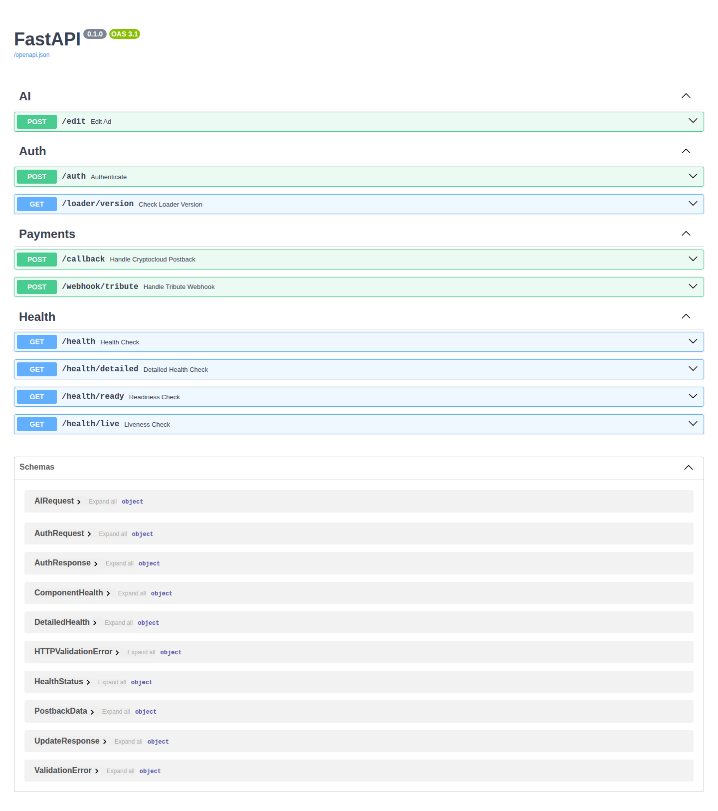
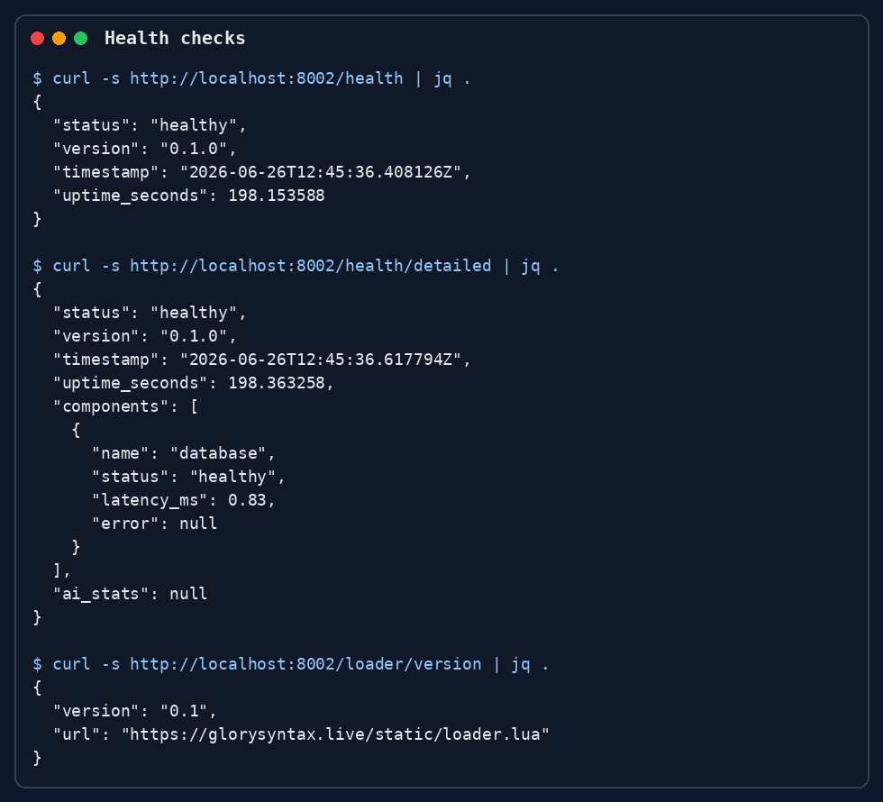
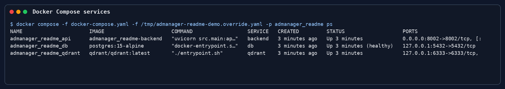
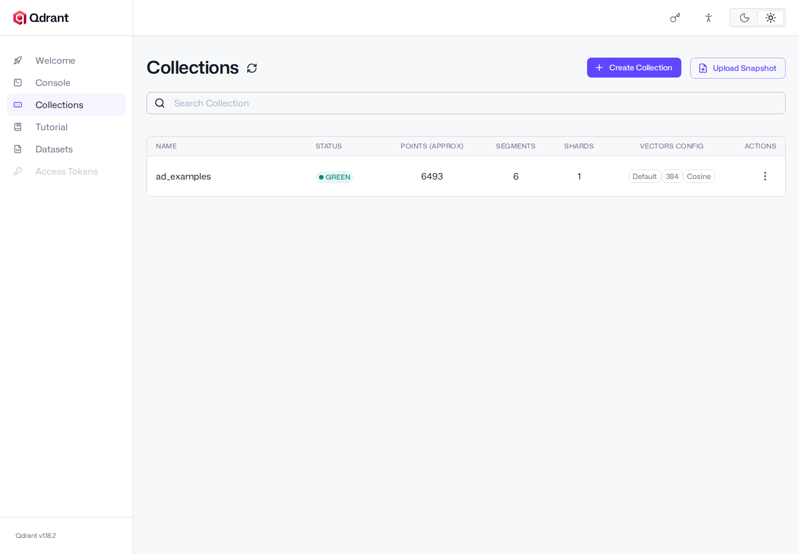
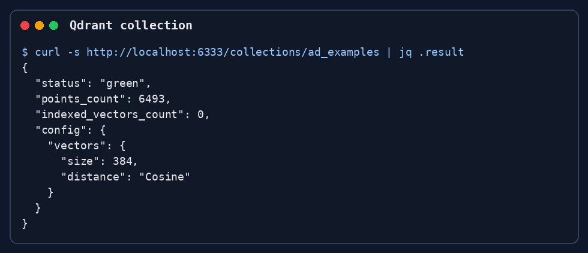
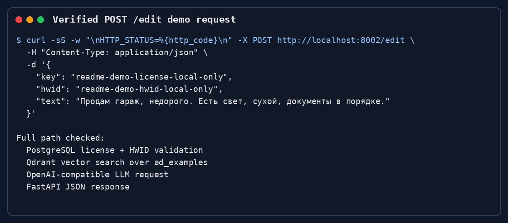
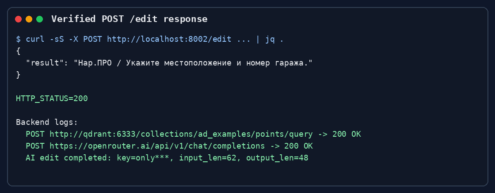
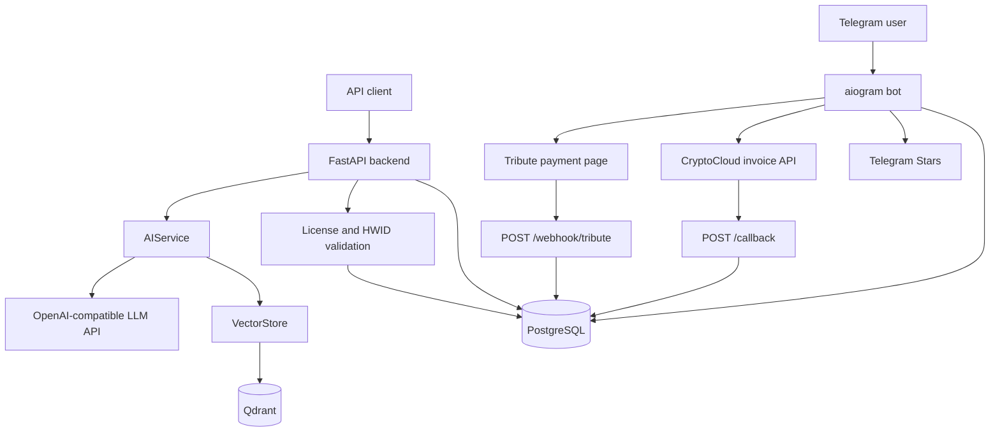
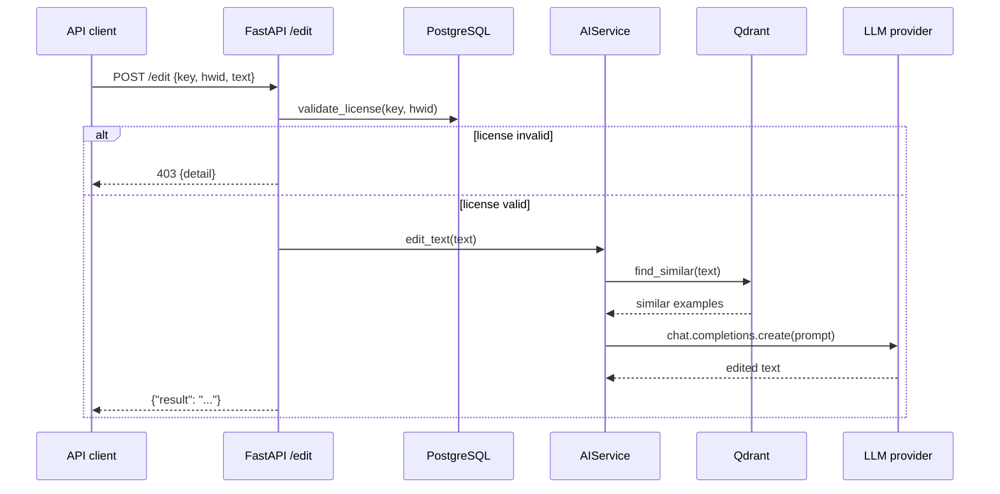

# AdManager — AI-сервис для редактирования рекламных объявлений

[](pyproject.toml)
[](pyproject.toml)
[](docker-compose.yaml)
[](docker-compose.yaml)
[](docker-compose.yaml)
[](LICENSE)

`AdManager` — backend-проект для AI-редактирования рекламных текстов. Сервис объединяет FastAPI API, проверку лицензий с HWID-привязкой, RAG-поиск похожих объявлений в Qdrant, Telegram-бота и webhook-интеграции для платежных сценариев.

Проект ориентирован на backend/API-интеграцию: локально можно проверить запуск контейнеров, OpenAPI-документацию, health checks, загрузку RAG-коллекции и полный `POST /edit` flow. Сценарий `/edit` проверен локально с synthetic license/HWID, созданными напрямую в PostgreSQL через Docker Compose, и LLM-настройками из существующего `.env`.

## Демо

Ниже показан локальный demo-запуск backend, PostgreSQL и Qdrant. Скриншоты сделаны с реально запущенного сервиса на `localhost:8002`.











[Смотреть короткую демонстрацию API flow](docs/assets/readme/demo-api-flow.mp4)





[Смотреть demo-flow `/edit`](docs/assets/readme/demo-edit-flow.mp4)

## Возможности

### Основные возможности

| Возможность | Статус проверки | Детали |
|---|---|---|
| AI-редактирование объявлений | Проверено локально | `POST /edit` проверяет `key` и `hwid`, выполняет RAG-поиск в Qdrant, вызывает OpenAI-compatible LLM provider и возвращает `{"result": "..."}`. |
| Лицензирование и HWID | Покрыто тестами | Лицензия активируется при первом HWID, отклоняет истекшие, заблокированные и привязанные к другому HWID ключи. |
| Выдача защищенного Lua payload | Предусмотрено кодом | `POST /auth` валидирует лицензию и возвращает XOR + Base64 содержимое файла из `SCRIPT_PATH`. |
| Loader version endpoint | Проверено локально | `GET /loader/version` читает `loader_version.json`. |
| RAG-поиск похожих объявлений | Проверено локально | Qdrant collection `ad_examples` создана и заполнена 6493 точками из `src/AI/data.jsonl`. |
| Telegram-бот | Проверено на запуск | Aiogram bot стартует в polling mode с текущим `.env`; пользовательский диалог не снимался, чтобы не публиковать приватные Telegram-данные. |
| Платежные интеграции | Предусмотрено кодом | Есть CryptoCloud callback, Tribute webhook с HMAC-проверкой и Telegram Stars flow в bot-коде. Реальные платежные операции не выполнялись. |

### Технические возможности

- FastAPI application с OpenAPI/Swagger/ReDoc.
- Асинхронный PostgreSQL доступ через SQLAlchemy и `asyncpg`.
- Alembic-инфраструктура для миграций.
- Qdrant vector storage с incremental sync из JSONL.
- Embeddings через `sentence-transformers`.
- OpenAI-compatible LLM client через `openai.AsyncOpenAI`.
- In-memory rate limiting middleware для API abuse protection.
- Docker Compose для backend, PostgreSQL, Qdrant и bot.
- Unit/integration-style tests на `pytest`.
- CI/CD workflows для lint, typecheck, tests, image build/push и SSH deploy.

## Архитектура





## Стек

| Слой | Технология | Назначение |
|---|---|---|
| Backend | FastAPI, Uvicorn, Pydantic | HTTP API и OpenAPI-документация |
| Bot | aiogram | Telegram-интерфейс для лицензий, trial и покупок |
| Database | PostgreSQL 15 | Пользователи, лицензии, платежи |
| ORM | SQLAlchemy async, asyncpg | Асинхронная работа с БД |
| Migrations | Alembic | Миграционная инфраструктура |
| Vector DB | Qdrant | Хранение embeddings и поиск похожих примеров |
| AI/ML | OpenAI-compatible API, sentence-transformers | Генерация текста и embeddings |
| Package manager | uv | Управление Python-зависимостями |
| Containers | Docker Compose | Локальный и серверный запуск |
| Quality | pytest, ruff, mypy, pre-commit | Тесты и статические проверки |

## Быстрый старт

### 1. Клонирование

```bash
git clone https://github.com/GloryWater/backend-for-using-ai.git
cd backend-for-using-ai
```

### 2. Настройка окружения

```bash
cp .env.example .env
```

Заполните `.env` безопасными значениями для локального запуска. Не коммитьте `.env`.

Для полного `POST /edit` flow нужны рабочие LLM-настройки и валидная лицензия. Для локального development/demo можно создать synthetic license напрямую в PostgreSQL, как показано ниже в разделе [Проверенный demo-flow `/edit`](#проверенный-demo-flow-edit).

### 3. Запуск через Docker Compose

```bash
docker compose up -d --build
docker compose ps
docker compose logs --tail=200
```

Первый старт backend может занять время: приложение загружает модель `sentence-transformers/paraphrase-multilingual-MiniLM-L12-v2` и синхронизирует Qdrant collection из `src/AI/data.jsonl`.

### 4. Проверка

```bash
curl -s http://localhost:8002/health | jq .
curl -s http://localhost:8002/health/detailed | jq .
curl -s http://localhost:8002/loader/version | jq .
```

API-документация:

- Swagger UI: `http://localhost:8002/docs`
- ReDoc: `http://localhost:8002/redoc`
- OpenAPI JSON: `http://localhost:8002/openapi.json`
- Qdrant dashboard: `http://localhost:6333/dashboard`

## Локальная разработка

```bash
uv sync --dev
docker compose up -d db qdrant
uv run alembic upgrade head
uv run uvicorn src.main:app --reload --host 0.0.0.0 --port 8002
```

Telegram-бот запускается отдельно и требует реальный токен:

```bash
uv run python -m src.bot.bot
```

Если нужен только API demo без Telegram, запускайте `db`, `qdrant` и `backend`. Полный compose также стартует bot-процесс, если `BOT_TOKEN` корректно задан в `.env`.

## Переменные окружения

Значения берутся из `.env`; пример находится в `.env.example`.

| Переменная | Обязательна | Пример | Назначение |
|---|---:|---|---|
| `DB_USER` | Да | `postgres` | Пользователь PostgreSQL. |
| `DB_PASS` | Да | `local-dev-password` | Пароль PostgreSQL. |
| `DB_NAME` | Да | `admanager` | Имя базы данных. |
| `DB_HOST` | Да | `db` | Host PostgreSQL внутри Docker network. |
| `DB_PORT` | Да | `5432` | Порт PostgreSQL. |
| `LLM_API_KEY` | Да для `/edit` | `sk-...` | API key OpenAI-compatible LLM provider. |
| `LLM_BASE_URL` | Да для `/edit` | `https://api.openai.com/v1` | Base URL LLM provider. |
| `LLM_MODEL` | Да для `/edit` | `gpt-4o-mini` | Модель для `chat.completions`. |
| `LLM_TEMPERATURE` | Нет | `0.7` | Temperature генерации. |
| `LLM_MAX_TOKENS` | Нет | `500` | Максимум токенов ответа. |
| `BOT_TOKEN` | Да для bot | `123456:...` | Telegram bot token от BotFather. |
| `CRYPTOCLOUD_API_KEY` | Да для CryptoCloud | `...` | API key CryptoCloud. |
| `CRYPTOCLOUD_SHOP_ID` | Да для CryptoCloud | `...` | Shop ID CryptoCloud. |
| `CRYPTOCLOUD_SECRET` | Да для CryptoCloud | `...` | Secret для платежной интеграции. |
| `TRIBUTE_API_KEY` | Да для Tribute | `...` | Secret для HMAC-проверки Tribute webhook. |
| `QDRANT_URL` | Да | `http://qdrant:6333` | URL Qdrant из backend-контейнера. |
| `QDRANT_COLLECTION` | Да | `ad_examples` | Имя коллекции с RAG-примерами. |
| `ML_MODEL_NAME` | Да | `sentence-transformers/paraphrase-multilingual-MiniLM-L12-v2` | Модель embeddings. |
| `SIMILARITY_THRESHOLD` | Нет | `0.5` | Минимальный score похожих примеров. |
| `TOP_K_EXAMPLES` | Нет | `10` | Количество примеров для prompt context. |
| `RULES_FILE` | Да | `src/AI/rules.xml` | XML-правила редактирования. |
| `EXAMPLES_FILE` | Да | `src/AI/data.jsonl` | JSONL-примеры для Qdrant sync. |
| `SCRIPT_PATH` | Да для `/auth` | `protected/scriptV2.lua` | Lua script, который выдается после проверки лицензии. |
| `LOADER_VERSION_FILE` | Да | `loader_version.json` | Источник версии loader. |

## API endpoints

| Метод | Endpoint | Назначение | Credentials |
|---|---|---|---|
| `GET` | `/health` | Базовая проверка состояния backend. | Нет |
| `GET` | `/health/detailed` | Проверка backend и database component. | Нет |
| `GET` | `/health/ready` | Readiness probe. | Нет |
| `GET` | `/health/live` | Liveness probe. | Нет |
| `GET` | `/loader/version` | Версия и URL loader из `loader_version.json`. | Нет |
| `POST` | `/auth` | Проверка лицензии/HWID и выдача encrypted script payload. | Валидные `key` и `hwid` |
| `POST` | `/edit` | AI-редактирование текста объявления через license check, Qdrant/RAG и LLM. | Валидные `key`/`hwid` и LLM-настройки |
| `POST` | `/callback` | CryptoCloud postback handler. | Реальный payment payload |
| `POST` | `/webhook/tribute` | Tribute webhook handler с HMAC signature. | Header `trbt-signature` |

## Примеры запросов

Проверенные локально системные endpoints:

```bash
curl -s http://localhost:8002/health | jq .
```

```json
{
  "status": "healthy",
  "version": "0.1.0",
  "timestamp": "2026-06-26T12:43:31.979275Z",
  "uptime_seconds": 73.724738
}
```

```bash
curl -s http://localhost:8002/health/detailed | jq .
```

```json
{
  "status": "healthy",
  "version": "0.1.0",
  "components": [
    {
      "name": "database",
      "status": "healthy",
      "latency_ms": 1.63,
      "error": null
    }
  ],
  "ai_stats": null
}
```

```bash
curl -s http://localhost:8002/loader/version | jq .
```

```json
{
  "version": "0.1",
  "url": "https://glorysyntax.live/static/loader.lua"
}
```

## Проверенный demo-flow `/edit`

Сценарий ниже проверяет полный путь AI-редактирования текста:

1. Backend получает `POST /edit`.
2. PostgreSQL проверяет license key, срок действия, активность и HWID.
3. `AIService` обращается к Qdrant collection `ad_examples` за похожими примерами.
4. Backend выполняет запрос к OpenAI-compatible LLM provider.
5. API возвращает отредактированный рекламный текст в поле `result`.

Для локальной проверки была создана synthetic demo-лицензия `readme-demo-license-local-only` с HWID `readme-demo-hwid-local-only`. Это не production-ключ и не пользовательские данные.


[Смотреть короткое видео `/edit` demo-flow](docs/assets/readme/demo-edit-flow.mp4)

### Создание локальной тестовой лицензии

Команда ниже предназначена только для локального development/demo окружения. Она создает synthetic пользователя и лицензию через PostgreSQL внутри Docker Compose, не затрагивая другие записи.

```bash
docker compose exec -T db sh -lc 'psql -U "${POSTGRES_USER:-postgres}" -d "${POSTGRES_DB:-postgres}" -v ON_ERROR_STOP=1' <<'SQL'
INSERT INTO users (telegram_id, username, "isUsedTrial")
VALUES (900000001, 'readme_demo_user', false)
ON CONFLICT (telegram_id) DO UPDATE
SET username = EXCLUDED.username,
    "isUsedTrial" = false;

INSERT INTO licenses (key, hwid, is_active, expires_at, owner_id)
VALUES (
  'readme-demo-license-local-only',
  'readme-demo-hwid-local-only',
  true,
  now() + interval '30 days',
  900000001
)
ON CONFLICT (key) DO UPDATE
SET hwid = EXCLUDED.hwid,
    is_active = true,
    expires_at = now() + interval '30 days',
    owner_id = EXCLUDED.owner_id;
SQL
```

> Не используйте demo-license в production. Не публикуйте реальные license keys и HWID.

Проверенный запрос:

```bash
curl -sS -w "\nHTTP_STATUS=%{http_code}\n" -X POST http://localhost:8002/edit \
  -H "Content-Type: application/json" \
  -d '{
    "key": "readme-demo-license-local-only",
    "hwid": "readme-demo-hwid-local-only",
    "text": "Продам гараж, недорого. Есть свет, сухой, документы в порядке."
  }'
```

Проверенный ответ:

```json
{
  "result": "Нар.ПРО / Укажите местоположение и номер гаража."
}
```

```text
HTTP_STATUS=200
```

Backend logs подтвердили запрос к Qdrant и LLM provider:

```text
POST http://qdrant:6333/collections/ad_examples/points/query -> 200 OK
POST https://openrouter.ai/api/v1/chat/completions -> 200 OK
AI edit completed: key=only***, input_len=62, output_len=48
```

Форма запроса для `/auth`:

```bash
curl -X POST http://localhost:8002/auth \
  -H "Content-Type: application/json" \
  -d '{
    "key": "demo-license-key",
    "hwid": "demo-hwid"
  }'
```

Для успешного `/auth` дополнительно нужен файл по пути `SCRIPT_PATH`. По умолчанию это `protected/scriptV2.lua`.

## Telegram bot flow

Telegram-бот находится в `src/bot/bot.py` и использует inline-меню из `src/bot/keyboards.py`.

```mermaid
flowchart TD
    Start[/start] --> Register[Create or load user]
    Register --> Menu[Main menu]
    Menu --> Trial[7-day trial]
    Menu --> MyKey[Show license and HWID status]
    Menu --> Reset[Reset HWID]
    Menu --> Download[Download loader.lua]
    Menu --> Buy[Select payment method]
    Buy --> Stars[Telegram Stars]
    Buy --> Crypto[CryptoCloud invoice]
    Buy --> Tribute[Tribute payment page]
    Stars --> License[Create or extend license]
    Crypto --> License
    Tribute --> License
```

Скриншоты Telegram-диалога не включены, чтобы не публиковать реальные пользовательские данные. В проверенном Docker Compose запуске bot-контейнер успешно стартовал и перешел в polling mode с `BOT_TOKEN` из `.env`.

## Тестирование и качество кода

Быстрые тесты без load-сценариев:

```bash
uv run pytest tests/ -v --ignore=tests/load
```

Проверенный результат локального запуска: `144 passed, 2 skipped, 2 xfailed`.

Type checking:

```bash
uv run mypy src/ --ignore-missing-imports --disable-error-code=union-attr --disable-error-code=arg-type
```

Проверенный результат: `Success: no issues found in 23 source files`.

Ruff:

```bash
uvx ruff check .
uvx ruff format --check .
```

На момент проверки `uvx ruff check .` выявляет неиспользуемые imports в тестах (`F401/F811`). Это не мешает запуску backend, но должно быть исправлено перед тем, как считать lint job зеленым.

Load tests находятся в `tests/load/` и требуют явного флага:

```bash
uv run pytest tests/load/ -v --load
```

## CI/CD

В репозитории есть workflows:

| Workflow | Trigger | Что делает |
|---|---|---|
| `.github/workflows/ci.yml` | `push`/`pull_request` в `main` | Ruff, format check, MyPy, pytest с PostgreSQL/Qdrant services, Docker build/push, production deploy после push в `main`. |
| `.github/workflows/cd.yml` | `workflow_dispatch` | Ручной build/push в GHCR и deploy по SSH. |
| `.github/workflows/load-tests.yml` | `workflow_dispatch` | Ручной запуск load/stress/soak/spike/chaos тестов. |

Deploy steps используют GitHub Secrets: `SERVER_HOST`, `SERVER_USER` или `SERVER_USERNAME`, `SERVER_SSH_KEY`, `SERVER_PORT`, а также `GITHUB_TOKEN` для GHCR.

## Структура проекта

```text
.
├── src/
│   ├── AI/                 # rules.xml и data.jsonl для RAG
│   ├── bot/                # aiogram bot и keyboards
│   ├── database/           # SQLAlchemy models, session, CRUD
│   ├── middleware/         # rate limiting
│   ├── routes/             # FastAPI routes
│   ├── services/           # AI, Qdrant, payments, notifications
│   ├── utils/              # crypto/text helpers
│   └── main.py             # FastAPI app, lifespan, routers
├── tests/                  # pytest suite
│   └── load/               # load/stress/soak/spike/chaos tests
├── alembic/                # migration infrastructure
├── docs/assets/            # README media
├── docker-compose.yaml
├── Dockerfile
├── pyproject.toml
├── uv.lock
├── loader_version.json
└── README.md
```

## Troubleshooting

### Порт 8002 уже занят

```bash
lsof -i :8002
```

Остановите конфликтующий процесс или измените port mapping в `docker-compose.yaml`.

### PostgreSQL password authentication failed

Если вы меняли `DB_PASS` после первого старта, старый Docker volume может хранить PostgreSQL с прежним паролем.

Без удаления данных можно поднять отдельный demo-stack с другими volume names. Для полного сброса локальных данных:

```bash
docker compose down -v
docker compose up -d --build
```

Команда `down -v` удаляет локальные Docker volumes проекта, используйте ее только если данные не нужны.

### Backend долго не отвечает после старта

Первый startup загружает embedding model и синхронизирует Qdrant:

```bash
docker compose logs -f backend
```

В логах ожидаемы сообщения про Hugging Face model download и `Qdrant sync complete`.

### Bot перезапускается или получает Telegram Unauthorized

Проверьте `BOT_TOKEN` и логи bot-контейнера. При корректном токене в логах ожидаются сообщения о старте bot и polling mode.

```bash
docker compose logs -f bot
```

### Не работает `/edit`

Проверьте:

- валидность license key и HWID;
- `LLM_API_KEY`, `LLM_BASE_URL`, `LLM_MODEL`;
- доступность Qdrant;
- наличие и формат `src/AI/data.jsonl`;
- backend logs.

### Docker build слишком тяжелый

Во время проверки build context мог быть очень большим из-за локальных директорий вроде `.venv` и cache. Для production-friendly сборки стоит добавить `.dockerignore`, исключающий `.venv`, `.git`, `.pytest_cache`, `.ruff_cache`, README-видео и другие локальные артефакты.

## Безопасность

- Не коммитьте `.env`, реальные tokens, API keys, license keys, cookies и payment secrets.
- Храните production secrets в GitHub Actions secrets или переменных окружения сервера.
- Не публикуйте реальные license keys и HWID в issue, logs, screenshots и README.
- Tribute webhook signature проверяется через HMAC на основе `TRIBUTE_API_KEY`.
- `protected/scriptV2.lua` и loader payload не должны попадать в публичные логи.
- In-memory rate limiter подходит для одного процесса; для multi-instance production deployment лучше заменить его Redis-based limiter.

## Лицензия

Проект распространяется на условиях proprietary license. Подробности находятся в [LICENSE](LICENSE). Не называйте проект open-source без изменения лицензии владельцем.
